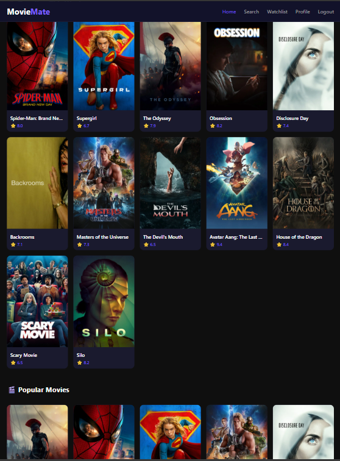
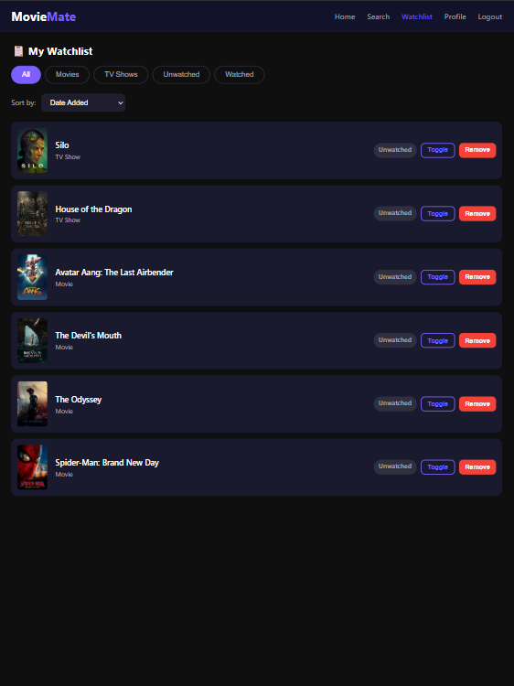

# Movie-Watchlist-App MovieMate

## MovieMate

MovieMate is a web application that helps users discover movies and television shows and organize them in a personal watchlist.

The application uses The Movie Database (TMDB) API to display trending titles, popular content, search results, and title details.

MovieMate was created by Group 7 as a semester project for CIS 1512: Software Engineering.

**Application Preview**



**Watchlist Features**



## Main Features

- Create an account and log in
- View trending and popular movies and television shows
- Search for movies and television shows
- View posters, ratings, release years, genres, and descriptions
- Add and remove titles from a personal watchlist
- Mark titles as watched or unwatched
- Filter the watchlist by:
  - Movies
  - Television shows
  - Watched titles
  - Unwatched titles
- Sort the watchlist by:
  - Title
  - Rating
  - Date added
- View profile information and watchlist totals
- Use the application on different screen sizes

## Technologies Used

- HTML
- CSS
- JavaScript
- TMDB API
- Browser Local Storage
- Git
- GitHub

## Project Structure

```text
movie-watchlist-app/
│
├── index.html
├── README.md
│
├── css/
│   └── style.css
│
├── js/
│   ├── api.js
│   ├── app.js
│   ├── auth.js
│   ├── config.js
│   └── watchlist.js
│
└── pages/
    ├── home.html
    ├── profile.html
    ├── search.html
    └── watchlist.html
```

## How to Run MovieMate

1. Download or clone the project.
2. Open the project folder in Visual Studio Code.
3. Create a free account with The Movie Database and get a TMDB API key.
4. Open `js/config.js`.
5. Add the API key using the following format:

```
const CONFIG = {
  API_KEY: 'YOUR_TMDB_API_KEY',
  BASE_URL: 'https://api.themoviedb.org/3',
  IMAGE_BASE_URL: 'https://image.tmdb.org/t/p/w500',
};
```

6. Open `index.html` using the Live Server extension.
7. Create an account and log in to use MovieMate.

## Data Storage

MovieMate uses browser Local Storage to save:

- Registered user accounts
- The currently logged-in user
- Personal watchlist items
- Watched and unwatched status
- The date each title was added

The saved information is available only in the same browser and on the same device.

## Current Project Scope

MovieMate is a working front-end semester project. It does not currently include movie streaming, personalized recommendations, social features, notifications, a backend database, or cross-device account access.

These features could be considered in a future version.

## Development Team

- Alexander Lor
- Bethlehem Balcha
- Meagan Azzo
- Sarah O’Neil
- Randy Carroll

## Course Information

- **Course:** CIS 1512: Software Engineering
- **Project:** MovieMate
- **Group:** Group 7
- **Year:** 2026
